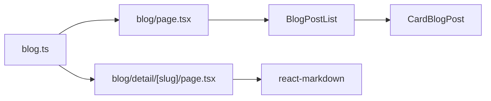

# Rencana: Fitur Blog Berbasis File

## Konteks saat ini

- Halaman [src/app/blog/page.tsx](src/app/blog/page.tsx) menampilkan **NotBlog** (placeholder "There is no writing yet"); [BlogContent](src/components/Fragments/BlogContent.tsx) di-comment dan memakai CardProject dengan satu card hardcoded ke `/blog/detail/KSHU328DSJWH`.
- Halaman [src/app/blog/detail/[slug]/page.tsx](src/app/blog/detail/[slug]/page.tsx) menerima `slug` tapi tidak menampilkan konten; tidak ada Navbar/Sidebar; metadata hardcoded.
- Belum ada dependency untuk Markdown; konten blog akan disimpan sebagai **Markdown** agar mudah diedit di file.

## Arah solusi

- **Sumber data**: Satu file `src/data/blog.ts` berisi tipe dan array post. Setiap post punya: `slug`, `title`, `description`, `datePublished`, `dateModified` (opsional), `image` (opsional), `content` (string Markdown). Anda mengedit isi blog dengan mengedit file ini lalu deploy.
- **Daftar blog**: Halaman `/blog` menampilkan daftar post dari data (kartu dengan title, description, tanggal, link ke `/blog/detail/[slug]`). Satu contoh post disertakan.
- **Detail blog**: Halaman `/blog/detail/[slug]` menampilkan satu post (layout Navbar + Sidebar, judul, tanggal, konten yang di-render dari Markdown).
- **Markdown**: Tambah dependency `react-markdown` untuk merender `content` di halaman detail.

---

## 1. Model data blog

Struktur per post (di `src/data/blog.ts`):

- **slug** (string, unik, dipakai di URL)
- **title** (string)
- **description** (string, untuk list card dan meta description)
- **datePublished** (string, mis. `YYYY-MM-DD`)
- **dateModified** (string, opsional)
- **image** (string, path ke `/public/img/`, opsional)
- **content** (string, isi artikel dalam **Markdown**)

Satu contoh blog: tema "Pengertian dan penggunaan HTML" (sesuai placeholder yang ada), dengan beberapa paragraf Markdown singkat.

---

## 2. File dan komponen

| Tujuan                                                     | File                                                                                                                                                                                                                                                                |
| ---------------------------------------------------------- | ------------------------------------------------------------------------------------------------------------------------------------------------------------------------------------------------------------------------------------------------------------------- |
| Sumber data + tipe (Anda edit ini untuk mengedit isi blog) | **Baru**: [src/data/blog.ts](src/data/blog.ts)                                                                                                                                                                                                                      |
| Kartu satu post di list                                    | **Baru**: `src/components/Elements/Cards/CardBlogPost.tsx` (atau dipakai langsung di Fragment)                                                                                                                                                                      |
| Daftar post di halaman blog                                | **Baru** atau **Ubah**: Fragment daftar blog, mis. `src/components/Fragments/BlogPostList.tsx`                                                                                                                                                                      |
| Halaman list                                               | **Ubah**: [src/app/blog/page.tsx](src/app/blog/page.tsx) — ganti NotBlog dengan daftar dari data; jika ada post tampilkan list, jika kosong bisa tetap NotBlog                                                                                                      |
| Halaman detail                                             | **Ubah**: [src/app/blog/detail/[slug]/page.tsx](src/app/blog/detail/[slug]/page.tsx) — baca post dari data by slug, layout Navbar+Sidebar, render title + date + body (Markdown via react-markdown), `generateStaticParams` dari data, `generateMetadata` dari post |
| Render Markdown                                            | Halaman detail: komponen kecil yang menerima `content: string` dan render dengan `react-markdown` (styling dasar untuk heading, paragraph, list, link)                                                                                                              |

- **SEO**: Metadata halaman detail dari post (title, description); canonical `/blog/detail/[slug]`. List page tetap pakai [src/seo/blog.ts](src/seo/blog.ts) yang ada; optional: per-post JSON-LD BlogPosting di detail.

---

## 3. Alur data

- **List**: `blog/page.tsx` import array post dari `blog.ts`, pass ke Fragment daftar; Fragment map ke kartu (CardBlogPost) dengan link ke `/blog/detail/[slug]`.
- **Detail**: `blog/detail/[slug]/page.tsx` import array, cari post by `params.slug`; jika tidak ditemukan tampilkan 404 atau redirect; jika ada, render layout + judul + tanggal + `<ReactMarkdown>` untuk `content`.

---

## 4. Dependency

- Tambah **react-markdown** (dan optional **remark-gfm** untuk tabel/autolink jika ingin) untuk merender `content` di halaman detail. Styling dasar (prose) bisa pakai class Tailwind atau inline style agar heading/paragraf/list terbaca.

---

## 5. UI dan konsistensi

- **List**: Kartu mirip pola yang ada (mis. card rounded bg-slate-100 dark:bg-slate-900), tampilkan title, description, date, optional image; link ke `/blog/detail/[slug]`. Animasi pakai `boxVariant` dari [landingAnimation.config.ts](src/components/utils/landingAnimation.config.ts).
- **Detail**: Layout sama dengan halaman lain (Navbar, Sidebar, main area); judul (h1), tanggal (datePublished / dateModified), lalu blok konten yang di-render dari Markdown dengan class untuk typography (paragraph, heading, list, link).
- Gambar contoh bisa pakai [public/img/example-blog.png](public/img/example-blog.png) untuk post contoh jika ingin.

---

## 6. Ringkasan langkah implementasi

1. **Tambah dependency**: `react-markdown` (dan optional `remark-gfm`).
2. **Buat** [src/data/blog.ts](src/data/blog.ts): tipe `BlogPost`, export array `blogPosts` dengan **1 contoh post** (slug, title, description, datePublished, image opsional, content dalam Markdown).
3. **Buat** komponen kartu post untuk list: `CardBlogPost.tsx` (title, description, date, link, optional image).
4. **Buat** Fragment daftar: `BlogPostList.tsx` yang menerima `posts`, render grid daftar `CardBlogPost`.
5. **Ubah** [src/app/blog/page.tsx](src/app/blog/page.tsx): import `blogPosts`, jika `blogPosts.length > 0` render `BlogPostList`, else render `NotBlog`.
6. **Ubah** [src/app/blog/detail/[slug]/page.tsx](src/app/blog/detail/[slug]/page.tsx): import `blogPosts`, cari post by slug; tambah Navbar + Sidebar; render judul, tanggal, dan konten via `react-markdown`; `generateStaticParams` return slugs dari data; `generateMetadata` return title/description dari post (atau default jika tidak ketemu).
7. **(Opsional)** Tambah helper `getPostBySlug(slug)` di `blog.ts` untuk dipakai di detail page dan generateMetadata.
8. **(Opsional)** Styling Markdown: komponen wrapper untuk `ReactMarkdown` dengan class prose atau custom class (heading, p, ul, a).

---

## 7. Cara mengedit isi blog

- **Sekarang**: Edit [src/data/blog.ts](src/data/blog.ts) — ubah field `title`, `description`, `content` (Markdown), tanggal, atau tambah post baru ke array — lalu commit dan deploy.
- **Konten**: Field `content` berisi string Markdown; di halaman detail di-render dengan `react-markdown` sehingga paragraf, heading, list, link akan tampil benar.

