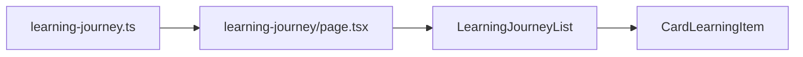

# Rencana: Fitur Learning Journey

## Konteks saat ini

- Halaman [src/app/learning-journey/page.tsx](src/app/learning-journey/page.tsx) saat ini **memakai komponen yang sama** dengan showcase project (`CardsProject`), jadi isinya proyek, bukan "apa yang sedang dipelajari".
- Data di portfolio saat ini **hardcoded** di dalam komponen (contoh: [CardsProject.tsx](src/components/Fragments/CardsProject.tsx)); tidak ada backend/DB.

## Arah solusi

- **Sumber data**: Satu file data terpusat (mis. `src/data/learning-journey.ts`) berisi daftar item learning. Anda memodifikasi data dengan **mengedit file ini** lalu deploy; tidak perlu backend.
- **Tampilan publik**: Halaman `/learning-journey` menampilkan daftar item (topik, status, progress, deskripsi, link resource) sehingga orang lain bisa melihat apa yang sedang Anda pelajari.
- **Cara modifikasi**: Edit file data → commit → deploy. Jika nanti ingin edit lewat form di web, bisa ditambah lapisan admin + API (opsi lanjutan).

---

## 1. Model data Learning Journey

Struktur per item yang disarankan:

- **id** (string, unik)
- **title** (nama topik/skill, mis. "Next.js App Router")
- **description** (opsional, penjelasan singkat)
- **status**: `"learning"` | `"completed"` | `"planned"`
- **progress** (0–100, opsional; untuk status `learning`/`completed`)
- **startedAt** (tanggal mulai, opsional; string ISO atau `YYYY-MM-DD`)
- **resourceUrl** (link ke kursus/docs, opsional)
- **techStack** (array path ke icon di `/public/icons/`, opsional; konsisten dengan [CardsProject](src/components/Fragments/CardsProject.tsx))

Contoh isi file:

```ts
// src/data/learning-journey.ts
export const learningJourneyItems = [
  {
    id: "1",
    title: "Next.js App Router",
    description: "Deep dive into server components and routing.",
    status: "learning",
    progress: 60,
    startedAt: "2025-01-15",
    resourceUrl: "https://nextjs.org/docs",
    techStack: ["/icons/nextjs.svg", "/icons/typescript.svg"],
  },
  // ...
];
```

---

## 2. File dan komponen yang akan dibuat/diubah


| Tujuan                                                  | File                                                                                                                                                                          |
| ------------------------------------------------------- | ----------------------------------------------------------------------------------------------------------------------------------------------------------------------------- |
| Sumber data (Anda edit ini untuk modifikasi)            | **Baru**: `src/data/learning-journey.ts`                                                                                                                                      |
| Tipe TypeScript untuk item                              | Bisa di file data yang sama atau `src/types/learning-journey.ts`                                                                                                              |
| Satu kartu/baris per item                               | **Baru**: `src/components/Elements/Cards/CardLearningItem.tsx` (atau nama serupa)                                                                                             |
| Daftar + pengelompokan (learning / completed / planned) | **Baru**: `src/components/Fragments/LearningJourneyList.tsx`                                                                                                                  |
| Halaman publik                                          | **Ubah**: [src/app/learning-journey/page.tsx](src/app/learning-journey/page.tsx) — ganti `CardsProject` dengan `LearningJourneyList`, import data dari `learning-journey.ts`  |
| SEO khusus learning journey                             | **Baru**: `src/seo/learning-journey.ts` (metadata + JSON-LD jika perlu); **Ubah**: metadata di `page.tsx` agar pakai deskripsi/canonical yang benar (bukan showcase-project). |


Tidak perlu mengubah [Navigation.tsx](src/components/Elements/Sections/Navigation.tsx) (link `/learning-journey` sudah ada).

---

## 3. Alur data (high-level)




- **Page**: import `learningJourneyItems` dari `src/data/learning-journey.ts`, pass ke `LearningJourneyList`.
- **LearningJourneyList**: group by `status` (learning / completed / planned), map ke `CardLearningItem`.
- **CardLearningItem**: tampilkan title, description, progress bar (jika ada), status badge, link resource, tech stack icons (pakai pola yang sama dengan [CardProject](src/components/Elements/Cards/CardProject.tsx) untuk konsistensi visual).

---

## 4. UI dan konsistensi

- **Kartu**: Mengikuti gaya card yang ada (mis. `card rounded bg-slate-100 dark:bg-slate-900`) dan spacing yang dipakai di [CardsProject](src/components/Fragments/CardsProject.tsx) / [CardCareer](src/components/Elements/Cards/CardCareer.tsx).
- **Animasi**: Pakai `framer-motion` + `boxVariant` dari [landingAnimation.config.ts](src/components/utils/landingAnimation.config.ts) agar konsisten dengan halaman lain.
- **Progress**: Bar sederhana (div + width berdasarkan `progress`); warna bisa berbeda untuk status (mis. biru = learning, hijau = completed).
- **Status**: Badge atau label teks (Learning / Completed / Planned).

---

## 5. SEO

- Di [learning-journey/page.tsx](src/app/learning-journey/page.tsx): ganti `metadata` dan `showcaseJsonld()` dengan metadata dan JSON-LD khusus learning journey (judul/deskripsi tentang "apa yang sedang dipelajari", canonical `/learning-journey`).

---

## 6. Ringkasan langkah implementasi

1. **Buat** `src/data/learning-journey.ts` (dan tipe jika dipisah) dengan struktur di atas; isi 2–3 item contoh.
2. **Buat** `CardLearningItem.tsx` untuk satu item (title, description, status, progress, link, tech stack).
3. **Buat** `LearningJourneyList.tsx` yang menerima `items`, group by `status`, render list of `CardLearningItem`.
4. **Ubah** `learning-journey/page.tsx`: import data, render `LearningJourneyList` instead of `CardsProject`, pasang metadata + SEO yang benar.
5. **Buat** `src/seo/learning-journey.ts` untuk metadata/JSON-LD halaman learning journey.
6. **(Opsional)** Tambah filter/tab "All / Learning / Completed / Planned" di UI jika ingin.

---

## 7. Modifikasi data oleh Anda

- **Sekarang**: Edit `src/data/learning-journey.ts` (tambah/edit/hapus item, ubah `status`, `progress`, `description`, dll) → commit → deploy. Pengunjung akan selalu melihat versi terbaru setelah deploy.
- **Nanti (opsional)**: Bisa ditambah route `/learning-journey/admin` (dengan proteksi sederhana, mis. env password) + API route untuk read/write; backend bisa menyimpan ke file yang sama atau ke DB. Itu bisa jadi fase kedua setelah fitur file-based jalan.

Jika Anda setuju dengan pendekatan "modifikasi lewat edit file" ini, langkah di atas cukup untuk fitur pertama. Jika Anda ingin dari awal bisa edit lewat form di web, bisa disebutkan dan rencana bisa disesuaikan (tambah API + penyimpanan).