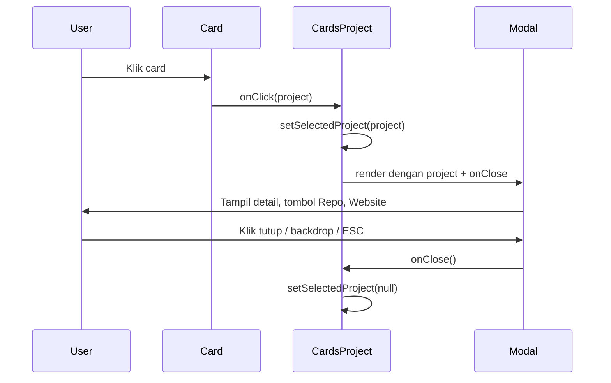

# Rencana: List Project dengan Modal Detail

## Konteks saat ini

- [CardsProject.tsx](src/components/Fragments/CardsProject.tsx) berisi **data hardcoded** dan merender [CardProject](src/components/Elements/Cards/CardProject.tsx).
- [CardProject](src/components/Elements/Cards/CardProject.tsx) adalah **Link** langsung ke `linkProject` (GitHub atau live site); tidak ada pemisahan repository vs website, dan tidak ada cerita/detail panjang.
- Belum ada komponen modal/dialog di project.

## Arah solusi

- **Sumber data**: Satu file `src/data/projects.ts` berisi tipe dan array project. Setiap project punya: `id`, `title`, `desc`, `imgProject`, `repositoryUrl?` (opsional; "jika published"), `websiteUrl?` (opsional), `detail` (string cerita/penjelasan project), `techStack` (array path icon). Edit data di file ini.
- **Perilaku card**: Klik card **membuka modal** (bukan navigasi langsung). Di dalam modal: judul, gambar, section **Detail** (isi `detail`), tombol **Lihat repository** (hanya tampil jika `repositoryUrl` ada), tombol **Kunjungi website** (hanya tampil jika `websiteUrl` ada), dan tech stack.
- **Modal**: Komponen dialog/modal baru (overlay + panel, tombol tutup, trap focus/ESC untuk aksesibilitas dasar).

---

## 1. Model data project

Struktur per project (di `src/data/projects.ts`):

- **id** (string, unik)
- **title** (string)
- **desc** (string, ringkasan untuk card)
- **imgProject** (string, path ke `/public/img/`)
- **repositoryUrl** (string, opsional; kalau ada = "published", tampilkan "Lihat repository")
- **websiteUrl** (string, opsional; tampilkan "Kunjungi website")
- **detail** (string, cerita/penjelasan panjang untuk section Detail di modal)
- **techStack** (array `{ logoUrl: string; alt: string }` atau path saja, konsisten dengan CardProject)

Contoh mapping dari data saat ini:

- E-Comerce Garuda Store: `repositoryUrl` = GitHub, `websiteUrl` kosong atau demo jika ada; `detail` = cerita singkat project.
- Baarshop: `websiteUrl` = baarshopid.vercel.app, `repositoryUrl` kosong atau isi jika ada; `detail` = penjelasan.
- Personal Portfolio: `websiteUrl` = galih.roswandi.com, `repositoryUrl` opsional; `detail` = cerita.
- Kedain: `websiteUrl` = kedain.roswandi.com, `repositoryUrl` opsional; `detail` = cerita.

---

## 2. File dan komponen

| Tujuan                                     | File                                                                                                                                                                                                                                                                                                     |
| ------------------------------------------ | -------------------------------------------------------------------------------------------------------------------------------------------------------------------------------------------------------------------------------------------------------------------------------------------------------- |
| Sumber data project                        | **Baru**: [src/data/projects.ts](src/data/projects.ts)                                                                                                                                                                                                                                                   |
| Modal isi detail + tombol repo/website     | **Baru**: `src/components/Elements/ProjectDetailModal.tsx` (atau di folder yang sesuai)                                                                                                                                                                                                                  |
| Card project (klik buka modal, bukan Link) | **Ubah**: [CardProject.tsx](src/components/Elements/Cards/CardProject.tsx) — terima `project` atau props lengkap, pakai `button`/`div` + `onClick` buka modal; tetap tampilkan image, title, desc, tech stack                                                                                            |
| Daftar project pakai data + state modal    | **Ubah**: [CardsProject.tsx](src/components/Fragments/CardsProject.tsx) — import data dari `projects.ts`, state `selectedProject` (atau `modalProject`), r item; saat card diklik set `selectedProject`; render `ProjectDetailModal` jika `selectedProject` tidak null, dengan props project + `onClose` |

---

## 3. Alur interaksi

- **Card**: Tidak lagi `<Link href={linkProject}>`. Ganti jadi elemen klik (mis. `button` atau `div` dengan `role="button"` dan `onClick`), panggil `onSelect(project)`.
- **CardsProject**: Memegang state `selectedProject`. Jika `selectedProject !== null`, render `ProjectDetailModal` dengan `project={selectedProject}` dan `onClose={() => setSelectedProject(null)}`.
- **Modal**: Judul, gambar, paragraf `detail`, tombol "Lihat repository" (link external) jika `repositoryUrl`, tombol "Kunjungi website" (link external) jika `websiteUrl`, tech stack, tombol "Tutup" / ikon X. Klik backdrop atau ESC menutup modal (`onClose`).

---

## 4. UI modal

- **Overlay**: Layer gelap (mis. `bg-black/50`) menutupi halaman, `fixed inset-0`, klik = tutup.
- **Panel**: Kotak konten di tengah (max-width, scroll jika panjang), berisi: gambar project, judul, section "Detail" dengan teks `detail`, dua tombol (Repository, Website) hanya jika URL ada, tech stack, tombol tutup.
- **Tutup**: Tombol X atau "Tutup" + tutup on Escape (useEffect + keydown `Escape`).
- **Gaya**: Konsisten dengan card (slate-100 / slate-900, rounded), dan dengan komponen lain di [CardsProject](src/components/Fragments/CardsProject.tsx) / [CardProject](src/components/Elements/Cards/CardProject.tsx).

---

## 5. Ringkasan langkah implementasi

1. **Buat** [src/data/projects.ts](src/data/projects.ts): tipe `Project`, export array `projects` dengan data keempat project yang ada; tambah field `repositoryUrl?`, `websiteUrl?`, dan `detail` (isi cerita/penjelasan untuk tiap project; bisa singkat dulu).
2. **Buat** komponen modal: `ProjectDetailModal.tsx` — props `project`, `onClose`; tampilkan image, title, detail, tombol Lihat repository (jika `repositoryUrl`), tombol Kunjungi website (jika `websiteUrl`), tech stack, tombol/ikon tutup; handle klik backdrop dan ESC.
3. **Ubah** [CardProject.tsx](src/components/Elements/Cards/CardProject.tsx): terima `project` (atau props terpisah) + `onSelect`; ganti `Link` jadi elemen klik yang memanggil `onSelect(project)`; tampilan card tetap (gambar, judul, desc, tech stack).
4. **Ubah** [CardsProject.tsx](src/components/Fragments/CardsProject.tsx): import `projects` dari `projects.ts`; state `selectedProject`; map `projects` ke `CardProject` dengan `onSelect={setSelectedProject}`; render `ProjectDetailModal` ketika `selectedProject` tidak null.
5. **(Opsional)** Trap focus di dalam modal (focus pertama ke panel, tab hanya di dalam modal sampai tutup) dan restore focus ke card yang dibuka saat modal ditutup.

---

## 6. Detail per project (contoh isi `detail`)

Anda bisa mengisi `detail` di `projects.ts` dengan cerita singkat per project, misalnya:

- E-Comerce Garuda Store: latar belakang, fitur (cart, auth, Firebase), pelajaran yang didapat.
- Landing Page Baarshop: tujuan untuk TikTok seller, stack, hasil.
- Personal Portfolio: tujuan situs ini, fitur (contact, blog, learning journey), tech.
- Kedain for UMKM: masalah yang dipecahkan, integrasi QRIS, stack.

Sekarang satu sumber data di [src/data/projects.ts](src/data/projects.ts); ubah di sana untuk mengubah tampilan list dan isi modal.