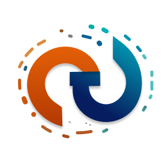

# Personal Portfolio
<p align="center">
  
</p>

This is a personal portfolio app built using Next.js and Tailwind CSS. The app displays projects, an about page, blogs, and contact information.

## Features
- **Projects**: Displays projects that you have worked on.
- **About**: An about page that explains who you are.
- **Blog**: Displays blog articles.
- **Contact**: A contact form for reaching out to you.

## Technology Used
- [Next.js](https://nextjs.org/)
- [Tailwind CSS](https://tailwindcss.com/)
- [Frammer motion](https://www.framer.com/motion/)
## Installation

1. Clone this repository
```bash
git clone git@github.com:galihroswandi/Personal-Portfolio.git
cd Personal-Portfolio
```

2. Install dependencies
```bash 
npm install
```

3. Running application
```bash
npm run dev
```


## Contributing

Contributions are always welcome!

See [Contributing](./CODE_OF_CONDUCT.md) for ways to get started.

Please adhere to this project's [Code of Conduct](./CODE_OF_CONDUCT.md).


## License

[MIT](https://choosealicense.com/licenses/mit/)


## Authors

- [@galihroswandi](https://www.github.com/galihroswandi)

